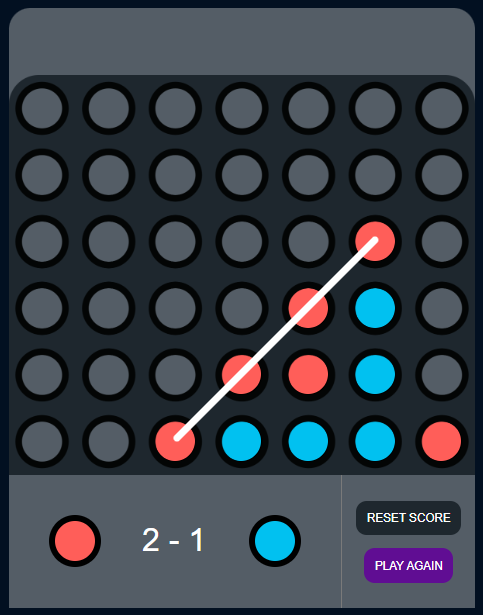

# Four In A Row Game



## Overview

**Four In A Row** is a classic two-player connection game where the objective is to be the first to form a horizontal, vertical, or diagonal line of four of one's own discs. This implementation is created using HTML, CSS, and JavaScript.

## Features

- **Interactive Gameplay**: Click on the columns to drop a ball and try to connect four in a row before your opponent.
- **Two-player Mode**: Play against a friend locally.
- **Score Tracking**: Keeps track of the score for each player.
- **Audio Effects**: Includes sound effects for ball placement and game actions.
- **Responsive Design**: Adapted for various screen sizes.

## Demo

Check out the live demo: [Four In A Row Game](https://your-demo-link.com)

## Video Tutorial

Watch the full tutorial on how to build this game on YouTube: [Four In A Row Game Tutorial](https://www.youtube.com/watch?v=your-tutorial-link)

## Installation

To run the game locally, follow these steps:

1. **Clone the repository:**

   ```bash
   git clone https://github.com/your-username/four-in-a-row-game-javascript.git
   ```

2. **Navigate to the project directory:**

   ```bash
   cd four-in-a-row-game-javascript
   ```

3. **Open the `index.html` file in your browser:**
   Simply open the file in any modern web browser to start the game.

## How to Play

1. The game starts with Player 1 (red) ready to place a ball.
2. Click on a column to drop your ball into that column.
3. The first player to connect four balls in a row, column, or diagonal wins the round.
4. Click "PLAY AGAIN" to start a new round.
5. Use "RESET SCORE" to clear the score history.

## Game Logic

- The game uses a 6x7 grid, represented as a matrix in JavaScript.
- The `play()` function handles the logic for dropping the ball, checking for win conditions, and switching players.
- Sound effects are triggered on specific actions like column selection and ball placement.

## Technologies Used

- **HTML**: Structure of the game interface.
- **CSS**: Styling for visual elements.
- **JavaScript**: Game logic and interactivity.

## License

This project is licensed under the MIT License. See the [LICENSE](LICENSE) file for details.

## Contributing

Contributions are welcome! If you have any ideas for improvements, feel free to open an issue or submit a pull request.

## Contact

If you have any questions or feedback, please contact me at [contact@codeexplained.org](mailto:contact@codeexplained.org).
